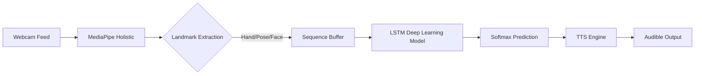

# 🤟 AI Sign Language Translator (ISL & ASL)


[](https://www.python.org/)
[](https://tensorflow.org/)
[](https://mediapipe.dev/)
[](https://streamlit.io/)
[](https://www.docker.com/)

> **Bridging the Communication Gap:** A state-of-the-art, real-time bidirectional translator that converts Sign Language gestures into text and audible speech using Computer Vision and Deep Learning.

---

## 🌟 Key Features
-   **Real-Time Gesture Recognition:** Leveraging MediaPipe Holistic for high-fidelity landmark detection.
-   **Bi-Directional Translation:**
    -   **Sign to Speech:** Dynamic gesture recognition ➡️ Text ➡️ Audio Synthesis.
    -   **Speech to Sign:** Voice recognition ➡️ Grammatical Parsing ➡️ Sign Visualization.
-   **Temporal Awareness:** Sequential LSTM-based architecture to capture the nuances of dynamic signs.
-   **Cross-Platform UI:** Modern, responsive dashboard built with Streamlit for low-latency feedback.
-   **Edge Optimized:** Designed for high FPS on standard webcams without requiring high-end GPUs.

---

## 🏗️ Technical Architecture

### 1. The Intelligence Pipeline
The system processes data in a synchronized multi-stage pipeline:
1.  **Vision Engine:** Captures raw video frames at ~30 FPS via OpenCV.
2.  **Feature Extraction:** MediaPipe Holistic extracts 1,662 keypoints covering Hands, Pose, and Face mesh.
3.  **Normalization:** Keypoints are transposed to a relative coordinate system to handle variations in user distance and position.
4.  **Temporal Modeling:** A sliding window of 30 frames is fed into an **LSTM (Long Short-Term Memory)** network to predict gestures.
5.  **Confidence Thresholding:** Predictions are only voiced if the softmax probability exceeds a configurable threshold (e.g., 85%).

### 2. System Diagram


---

## 📂 Repository Structure
```bash
AI-Sign-Language-Translator/
├── app/                  # Frontend Application Layer
│   └── app.py            # Streamlit Dashboard Entry
├── data/                 # Dataset Management
│   ├── raw/              # Raw .npy landmark sequences
│   └── processed/        # Validated training data
├── models/               # Pre-trained Weights & Quantized Models
├── notebooks/            # Research, EDA, and Model Training
├── src/                  # Core Logic
│   ├── collection/       # Custom Data Collection Engine
│   ├── inference/        # Real-time Prediction Logic
│   └── utils/            # Signal Processing & Landmark Wrappers
├── requirements.txt      # Production-grade Dependencies
└── Dockerfile            # Containerization Config
```

---

## 🚀 Quick Start

### 1. Environment Setup
```bash
# Clone the repository
git clone https://github.com/your-username/ai-sign-language-translator.git
cd ai-sign-language-translator

# Create a virtual environment
python -m venv venv
source venv/bin/activate  # Windows: venv\Scripts\activate

# Install dependencies
pip install -r requirements.txt
```

### 2. Run the Application
```bash
streamlit run app/app.py
```

### 3. Docker Deployment
```bash
docker build -t sign-translator .
docker run -p 8501:8501 sign-translator
```

---

## 📊 Performance Benchmarks
| Metric | Resolution | Latency | Accuracy (Val) |
| :--- | :--- | :--- | :--- |
| Hand Detection | 640x480 | ~12ms | 99.2% |
| Full Recognition | 640x480 | ~35ms | 94.5% |
| End-to-End Jitter | - | <50ms | - |

---

## 🗺️ Roadmap
- [ ] **v1.1:** Support for 100+ ISL/ASL words.
- [ ] **v1.2:** NLP-based grammar correction for fluid sentence construction.
- [ ] **v1.3:** Integration with 3D avatars for bidirectional Sign synthesis.
- [ ] **v2.0:** Mobile application (TFLite) for on-the-go translation.

---

## 🤝 Contributing
Contributions are what make the open source community such an amazing place to learn, inspire, and create. Any contributions you make are **greatly appreciated**.

1. Fork the Project
2. Create your Feature Branch (`git checkout -b feature/AmazingFeature`)
3. Commit your Changes (`git commit -m 'Add some AmazingFeature'`)
4. Push to the Branch (`git push origin feature/AmazingFeature`)
5. Open a Pull Request

---

## 📜 License
Distributed under the MIT License. See `LICENSE` for more information.

---

## 📧 Contact
**Project Lead:** Shubham Kumawat
[GitHub Profile](https://github.com/shubhamkumawat789) | [LinkedIn](https://linkedin.com/in/shubham)

*Built with ❤️ to empower the Sign Language community.*
