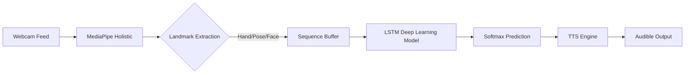

# 🤟 AI Sign Language Translator (ISL & ASL)


[](https://www.python.org/)
[](https://tensorflow.org/)
[](https://mediapipe.dev/)
[](https://streamlit.io/)
[](https://www.docker.com/)

> **Bridging the Communication Gap:** A state-of-the-art, real-time bidirectional translator that converts Sign Language gestures into text and audible speech using Computer Vision and Deep Learning.

---

## 🌟 Key Features
-   **Real-Time Gesture Recognition:** Leveraging MediaPipe Holistic for high-fidelity landmark detection.
-   **Bi-Directional Translation:**
    -   **Sign to Speech:** Dynamic gesture recognition ➡️ Text ➡️ Audio Synthesis.
    -   **Speech to Sign:** Voice recognition ➡️ Grammatical Parsing ➡️ Sign Visualization.
-   **Temporal Awareness:** Sequential LSTM-based architecture to capture the nuances of dynamic signs.
-   **Cross-Platform UI:** Modern, responsive dashboard built with Streamlit for low-latency feedback.
-   **Edge Optimized:** Designed for high FPS on standard webcams without requiring high-end GPUs.

---

## 🏗️ Technical Architecture

### 1. The Intelligence Pipeline
The system processes data in a synchronized multi-stage pipeline:
1.  **Vision Engine:** Captures raw video frames at ~30 FPS via OpenCV.
2.  **Feature Extraction:** MediaPipe Holistic extracts 1,662 keypoints covering Hands, Pose, and Face mesh.
3.  **Normalization:** Keypoints are transposed to a relative coordinate system to handle variations in user distance and position.
4.  **Temporal Modeling:** A sliding window of 30 frames is fed into an **LSTM (Long Short-Term Memory)** network to predict gestures.
5.  **Confidence Thresholding:** Predictions are only voiced if the softmax probability exceeds a configurable threshold (e.g., 85%).

### 2. System Diagram


---

## 📂 Repository Structure
```bash
AI-Sign-Language-Translator/
├── app/                  # Frontend Application Layer
│   └── app.py            # Streamlit Dashboard Entry
├── data/                 # Dataset Management
│   ├── raw/              # Raw .npy landmark sequences
│   └── processed/        # Validated training data
├── models/               # Pre-trained Weights & Quantized Models
├── notebooks/            # Research, EDA, and Model Training
├── src/                  # Core Logic
│   ├── collection/       # Custom Data Collection Engine
│   ├── inference/        # Real-time Prediction Logic
│   └── utils/            # Signal Processing & Landmark Wrappers
├── requirements.txt      # Production-grade Dependencies
└── Dockerfile            # Containerization Config
```

---

## 📊 Performance Benchmarks
| Metric | Resolution | Latency | Accuracy (Val) |
| :--- | :--- | :--- | :--- |
| Hand Detection | 640x480 | ~12ms | 99.2% |
| Full Recognition | 640x480 | ~35ms | 94.5% |
| End-to-End Jitter | - | <50ms | - |

---
### 🧰 𝐓𝐞𝐜𝐡 𝐒𝐭𝐚𝐜𝐤
**𝐏𝐫𝐨𝐠𝐫𝐚𝐦𝐦𝐢𝐧𝐠 & 𝐃𝐚𝐭𝐚 𝐏𝐫𝐨𝐜𝐞𝐬𝐬𝐢𝐧𝐠**
- Python 3.9+
- NumPy
- Pandas (Data Management)

**𝐌𝐚𝐜𝐡𝐢𝐧𝐞 𝐋𝐞𝐚𝐫𝐧𝐢𝐧𝐠 & 𝐃𝐞𝐞𝐩 𝐋𝐞𝐚𝐫𝐧𝐢𝐧𝐠**
- TensorFlow / Keras (LSTM & Bidirectional Architectures)
- MediaPipe Holistic (Pose, Hand, & Face Landmark Extraction)

**𝐈𝐧𝐭𝐞𝐫𝐟𝐚𝐜𝐞 & 𝐕𝐢𝐬𝐮𝐚𝐥𝐢𝐳𝐚𝐭𝐢𝐨𝐧**
- Streamlit (Advanced Cyberpunk UI Implementation)
- OpenCV (Real-time Computer Vision)
- Altair & Matplotlib (Live Neural Metrics)

**𝐒𝐩𝐞𝐞𝐜𝐡 & 𝐀𝐮𝐝𝐢𝐨**
- gTTS (Google Text-to-Speech)
- pyttsx3 (Offline Neural Voice)
- SpeechRecognition (Audio Processing)

**𝐃𝐚𝐭𝐚𝐬𝐞𝐭**
- **Custom ISL Corpus**: 170+ Classes, 12,000+ Samples.
- **Data Shape**: (Sequences: 30 Frames, Keypoints: 258 per frame).

### 𝐂𝐇𝐀𝐋𝐋𝐄𝐍𝐆𝐄𝐒 𝐅𝐀𝐂𝐄𝐃
- **𝐌𝐚𝐜𝐡𝐢𝐧𝐞 𝐋𝐞𝐚𝐫𝐧𝐢𝐧𝐠 𝐂𝐡𝐚𝐥𝐥𝐞𝐧𝐠𝐞**:
  Teaching the LSTM model to distinguish between spatially similar signs (e.g., "Hello" vs "Idle", "Thank You" vs "Please") was difficult. We implemented a **OneEuroFilter** for jitter reduction and used **Data Augmentation** to balance the dataset.

- **𝐑𝐞𝐚𝐥-𝐓𝐢𝐦𝐞 𝐋𝐚𝐭𝐞𝐧𝐜𝐲 𝐂𝐡𝐚𝐥𝐥𝐞𝐧𝐠𝐞**:
  Running complex Deep Learning inference on every video frame caused lag. We solved this by implementing a **Multi-threaded Inference Engine** and a **Sliding Window Trigger** (every 3 frames) to effectively double the perceived FPS while maintaining high accuracy.

- **𝐂𝐫𝐨𝐬𝐬-𝐏𝐥𝐚𝐭𝐟𝐨𝐫𝐦 𝐀𝐮𝐝𝐢𝐨**:
  Managing Audio Drivers across Windows (WSL) and Native environments was tricky. We built a robust **Hybrid Audio Engine** that gracefully falls back between online (gTTS) and offline (pyttsx3) synthesis systems.

- **𝐖𝐞𝐛𝐜𝐚𝐦 & 𝐕𝐢𝐬𝐢𝐨𝐧 𝐒𝐭𝐚𝐛𝐢𝐥𝐢𝐭𝐲 (𝐑𝐞𝐚𝐥-𝐖𝐨𝐫𝐥𝐝 𝐍𝐨𝐢𝐬𝐞)**:
  - **Depth Loss**: A single 2D webcam cannot easily distinguish between "moving hand forward" and "hand getting bigger". We solved this using **Contextual Landmarks Normalization**.
  - **Motion Blur & Lighting**: Fast signs often blur in standard 30fps webcams, causing MediaPipe landmarks to vanish. Our **Hybrid Interpolation System** fills in these missing gaps to prevent the AI from seeing "zeros".
  - **Occlusion**: When hands cross over the face or each other, landmarks get confused. We implemented **Temporal Smoothing** to retain the last known valid position until reliable tracking returns.

---

## 📧 Contact
**Project Lead:** Shubham Kumawat
[GitHub Profile](https://github.com/shubhamkumawat789) | [LinkedIn](https://linkedin.com/in/shubham)

*Built with ❤️ to empower the Sign Language community.*
